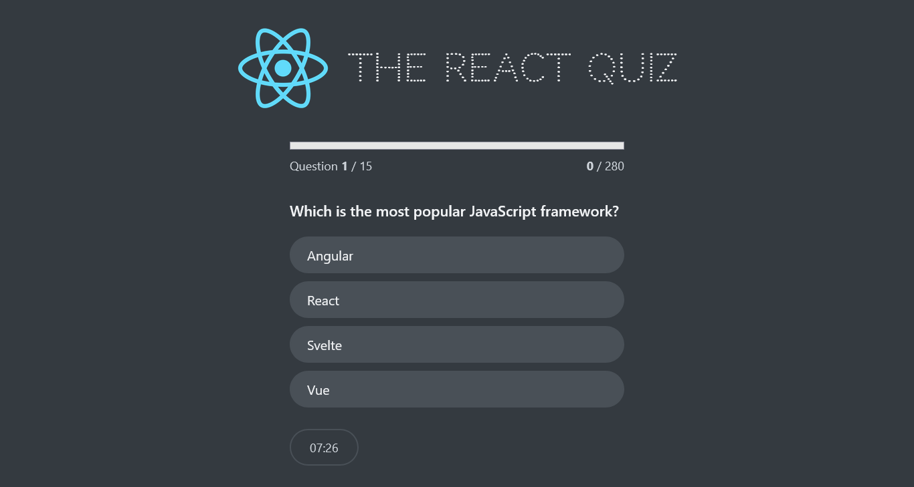

# 🧠 The React Quiz ⚛️

This is a quiz application built with React that tests a user's knowledge of the framework. It features a modern interface, question management and a timer to add a challenge. The app also keeps track of a high score.

---

## 🚀 How to Use

Just **Go to the site:** [React Quiz](https://Darkoray.github.io/react-quiz/). Everything is self explanatory :3

---

## ✨ Features

- **Interactive Questions** : Answer multiple-choice questions with instant feedback.
- **Progress Tracking** : See your current question number, points, and a progress bar.
- **Built-in Timer** : A countdown timer for each question adds a sense of urgency.
- **High Score** : The app saves your highest score in your browser.
- **Start & Finish Screens** : Clear screens to begin the quiz and view your final results.

---

## 🖼️ Layouts

These components define the structural foundation of the application.

- `FinishedScreen.js`: Displays the final score and an option to restart the quiz.
- `Footer.js`: A container for elements displayed at the bottom of the screen, such as the timer and navigation buttons.
- `Header.js`: Contains the application logo and title.
- `Main.js`: The central layout component where the main application content is rendered.
- `StartScreen.js`: The initial screen of the app, prompting the user to start the quiz.

## 🧩 Components

These components are responsible for the core functionality of the quiz.

- `Question.js`: Renders a single question and its options.
- `Options.js`: Displays the multiple-choice options for a given question and handles user selection.
- `NextButton.js`: A button that appears after a question has been answered, allowing the user to proceed to the next question or finish the quiz.
- `Progress.js`: Shows the user's progress through the quiz, including the current question number and score.
- `Timer.js`: Manages and displays the countdown timer during the quiz.

## ⚙️ Utilities

These are smaller, reusable components for general use.

- `Error.js`: Displays a message when an error occurs, such as a failed data fetch.
- `Loader.js`: Shows an animated loading spinner while the quiz data is being fetched.

---

## 

---

## 📂 Project Structure

```
src/
├─ components/
│   ├─ layouts/
│   │   ├─ FinishedScreen.js
│   │   ├─ Footer.js
│   │   ├─ Header.js
│   │   ├─ Main.js
│   │   └─ StartScreen.js
│   ├─ screen/
│   │   ├─ NextButton.js
│   │   ├─ Options.js
│   │   ├─ Progress.js
│   │   ├─ Question.js
│   │   └─ Timer.js
│   ├─ utilities/
│   │   ├─ Error.js
│   │   └─ Loader.js
│   ├─ App.js
│   └─ DateCounter.js
├─ index.css
└─ index.js
```

---

## 📄 License & Credits

This project is part of the course [**"The Ultimate React Course 2025: React, Next.js, Redux & More"**](https://www.udemy.com/course/the-ultimate-react-course/) by **Jonas Schmedtmann** and is provided for **learning purposes only**.

© by Jonas Schmedtmann. You can use it for your portfolio or learning. Do not use it to teach or redistribute as your own work.
